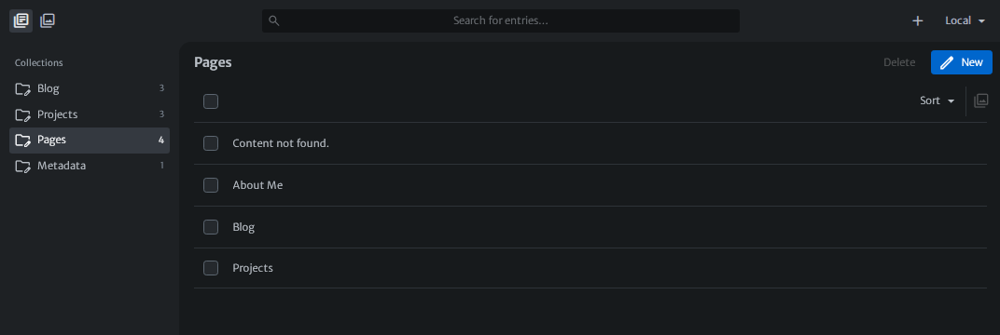

# 11ty-Sveltia-Pico

A 11ty Version by Adam Dj Brett

Need Help or have project ?? Contact Me
+ https://www.adamdjbrett.com
+ info@adamdjbrett.com

## How to




### Work with Sveltia CMS

Configure with your repo on `public/admin/config.yml`

```
backend:
  name: github
  repo: githubuser/yourrepo
  branch: main
```

Local Mode :

open on `localhost:8080/admin` - select your project and get started !!

Cloud Mode:

Deploy on Netlify / Vercel / CloudFlare - access your site yourdomain/admin


### Developer Code Base

Setup your site on `_data/metadata.yaml`
Home page on `content/index.md`
Static Page on `content/page/*.md`
Projects article on `content/projects/*.md`
Blog post on `content/posts/*.md`

